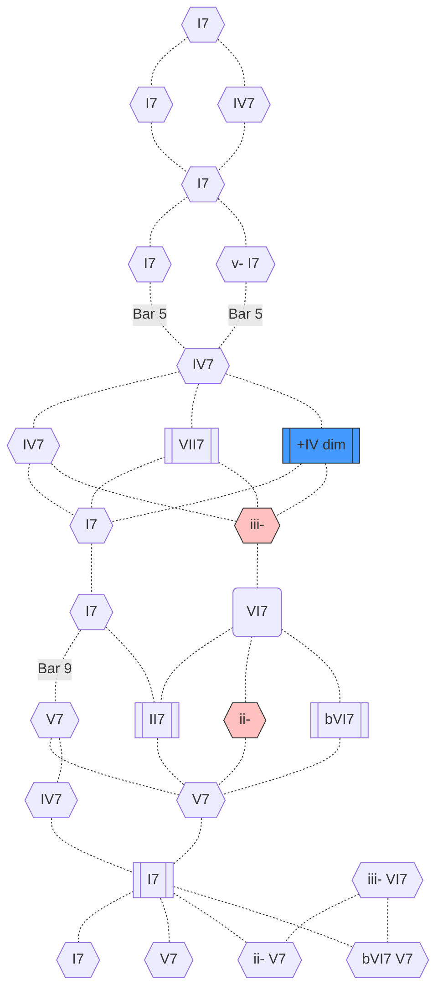

```mermaid
graph TD
    %% Bar 1
	B1_I7{{"I7"}}
    B1_I7 -.- B2_I7{{"I7"}}
    B1_I7 -.- B2_IV7{{"IV7"}}

    %% Bar 2 to 3
    B2_I7 -.- B3_I7{{"I7"}}
    B2_IV7 -.- B3_I7

    %% Bar 3 to 4
    B3_I7 -.- B4_I7{{"I7"}}
    B3_I7 -.- B4_turnaround{{"v- I7"}}

    %% Bar 4 to 5
    B4_turnaround -.-|Bar 5| B5_IV7{{"IV7"}}
    B4_I7 -.-|Bar 5| B5_IV7{{"IV7"}}

    %% Bar 5 to 6
    B5_IV7 -.- B6_IV7{{"IV7"}}
    B5_IV7 -.- B6_VII7[["VII7"]]
    B5_IV7 -.- B6_dim[["+IV dim"]]


    %% Bar 6 to 7
    B6_IV7 -.- B7_I7{{"I7"}}
    B6_VII7 -.- B7_I7
    B6_dim -.- B7_I7
	B6_IV7 -.- B7_iii
    B6_VII7 -.- B7_iii
    B6_dim -.- B7_iii


    %% Bar 7 to 8
    B7_I7 -.- B8_I7{{"I7"}}
    B7_iii{{"iii-"}} -.- B8_VI7
    
    %% Bar 8 to 9
    B8_I7{{"I7"}} -.-|Bar 9| B9_V7{{"V7"}}
    B8_VI7("VI7") -.- B9_II7[["II7"]]
    B8_VI7("VI7") -.- B9_ii[["ii-"]]
    B8_VI7("VI7") -.- B9_bvi7[["bVI7"]]
    B8_I7 -.- B9_II7


    %% Bar 9 to 10
    B9_V7 -.- B10_V7
    B9_V7 -.- B10_IV7
    B9_II7 -.- B10_V7
    B9_ii{{"ii-"}} -.- B10_V7
    B9_bvi7 -.- B10_V7

    %% Bar 10 to 11
    B10_V7{{"V7"}} -.- B11_I7
	B10_IV7{{"IV7"}} -.- B11_I7

    %% Bar 11 to 12
    B11_I7[["I7"]] -.- B12_I7{{"I7"}}
	B11_I7 -.- B12_V7{{"V7"}}
	B11_I7 -.- B12_25{{"ii- V7"}}
    B11_36{{"iii- VI7"}} -.- B12_25
    B11_36 -.- B12_bVI7V7
    B11_I7 -.- B12_bVI7V7{{"bVI7 V7"}}

   
%% Styling for Chord Types

classDef major fill:#f199,stroke:#333;

classDef minor fill:#f445,stroke:#333;

classDef diminished fill:#49f,stroke:#333, shape:circle;


class B10_Imaj7 major;

class B9_ii,B9_ii_7,B10_vi7,B10_iii_VI7,B11_ii_V7,B7_iii minor;

class B6_dim diminished;


```
